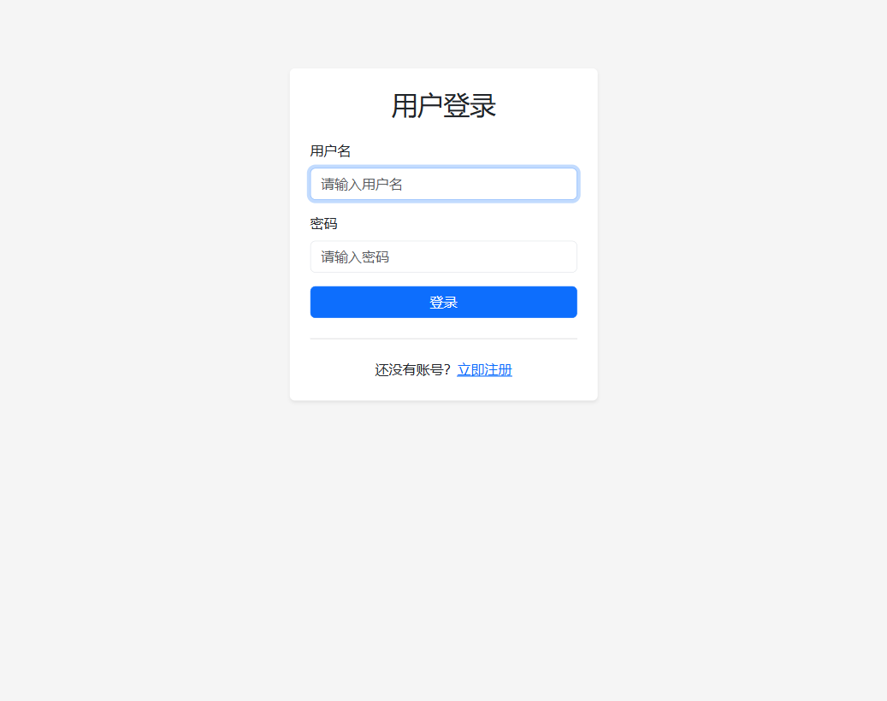
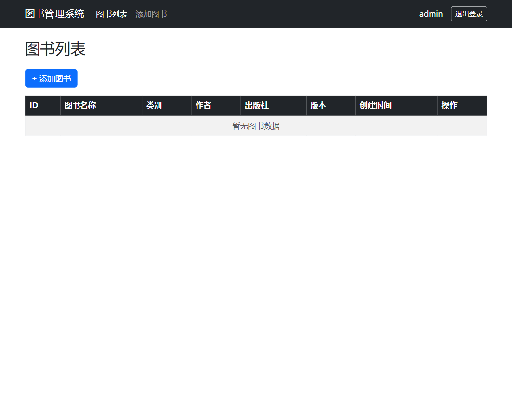
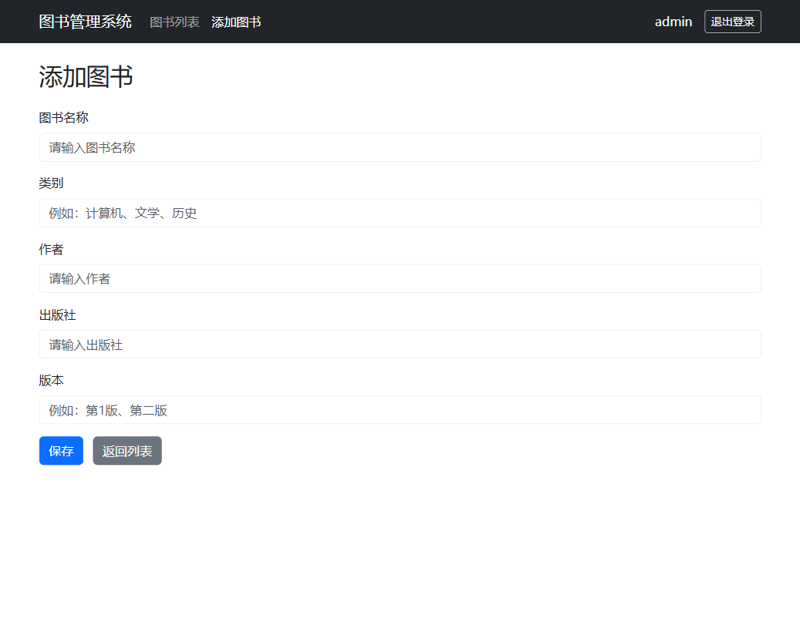
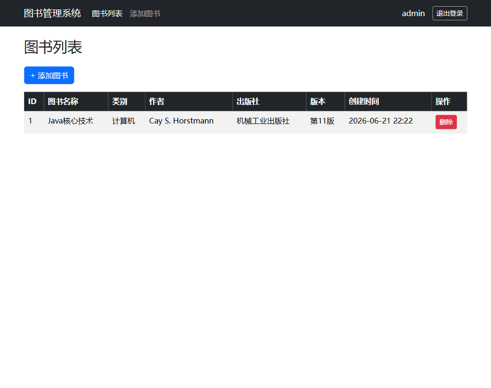

<<<<<<< HEAD
# 图书管理系统

一个基于 **Spring Boot + Spring Security + Thymeleaf + MyBatis + MySQL + Bootstrap** 的图书管理系统，适合作为 Java Web 课程设计或教学演示项目。

---

## 一、功能简介

本系统实现了图书信息的后台管理与网页端操作，主要功能包括：

- 用户注册与登录（Spring Security 认证）
- 图书信息的增删查（添加图书、删除图书、列表展示）
- 数据持久化到 MySQL 数据库
- 响应式前端页面（Bootstrap 5）

默认管理员账号：

- **账号：`admin`**
- **密码：`123456`**

---

## 二、技术栈

| 层级 | 技术 |
| --- | --- |
| 后端框架 | Spring Boot 3.2.0 |
| 安全认证 | Spring Security |
| 模板引擎 | Thymeleaf |
| 数据持久化 | MyBatis |
| 数据库 | MySQL 8.0 |
| 前端样式 | Bootstrap 5 |
| 构建工具 | Maven |

---

## 三、功能截图

### 登录页


### 图书列表


### 添加图书


### 添加图书后


---

## 四、快速开始

### 方式一：使用完整分发包（推荐零基础用户）

1. 从下方【环境安装包下载】处下载 `book-management.zip`。
2. 解压后得到完整项目文件夹（已包含源码、jar、SQL 脚本和安装包）。
3. 参考 [部署文档.md](部署文档.md) 完成 JDK、MySQL 安装和数据库初始化。
4. 在项目目录执行：

   ```cmd
   java -jar target/book-management-0.0.1-SNAPSHOT.jar
   ```

5. 浏览器访问 `http://localhost:8080`，使用 `admin/123456` 登录。

### 方式二：直接克隆源码运行

1. 克隆本仓库到本地。
2. 安装 JDK 17+ 和 MySQL 8.0，并创建数据库（见 [book-management.sql](book-management.sql)）。
3. （可选）使用 Maven 重新打包：

   ```cmd
   mvn clean package -DskipTests
   ```

4. 运行 jar：

   ```cmd
   java -jar target/book-management-0.0.1-SNAPSHOT.jar
   ```

5. 访问 `http://localhost:8080`。

---

## 五、环境安装包下载

由于 JDK 和 MySQL 安装包体积较大，不便直接存放在 GitHub 仓库中，请通过以下网盘链接下载：

| 软件 | 用途 | 下载链接 |
| --- | --- | --- |
| JDK 17 | 运行 Java 程序 | [点击下载](待填写) |
| MySQL 8.0 | 数据库存储 | [点击下载](待填写) |
| 7-Zip | 解压 `book-management.zip` | [点击下载](待填写) |
| book-management.zip | 完整项目分发包（含源码、jar、安装包、文档） | [点击下载](待填写) |

> 请将上述 `待填写` 替换为实际网盘分享链接。

---

## 六、详细部署文档

如果你不熟悉 Java 或 MySQL，请直接阅读 [部署文档.md](部署文档.md)。该文档从零开始，逐步讲解如何安装环境、初始化数据库、启动项目并使用系统。

---

## 七、目录结构

```text
book-management/
├── src/                              # 源代码
│   ├── main/
│   │   ├── java/com/example/bookmanagement/
│   │   │   ├── config/               # Spring Security 配置
│   │   │   ├── controller/           # 控制器
│   │   │   ├── entity/               # 实体类
│   │   │   ├── mapper/               # MyBatis Mapper
│   │   │   └── service/              # 业务逻辑
│   │   └── resources/
│   │       ├── templates/            # Thymeleaf 页面
│   │       └── application.yml       # 数据库配置
│   └── test/                         # 测试代码
├── book-management.sql               # 数据库初始化脚本
├── pom.xml                           # Maven 配置
├── 部署文档.md                        # 详细部署手册
└── README.md                         # 本文件
```

---

## 八、默认配置

`src/main/resources/application.yml` 中默认数据库配置：

```yaml
spring:
  datasource:
    url: jdbc:mysql://localhost:3306/book_management?useUnicode=true&characterEncoding=utf-8&serverTimezone=Asia/Shanghai&useSSL=false
    username: root
    password: 123456
```

如果你的 MySQL root 密码不同，请修改该文件后重新打包运行。

---

## 九、许可证

本项目仅用于教学和学习交流。
